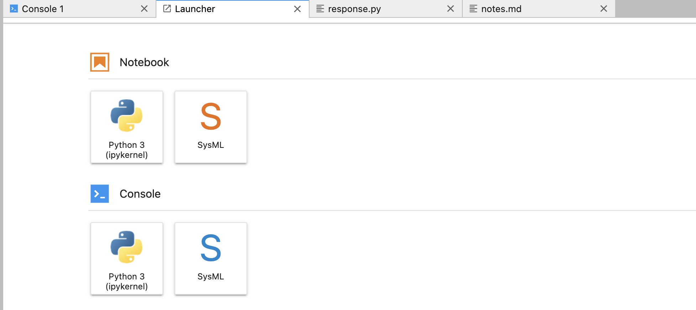

= Installation

== Windows
1. Install https://docs.conda.io/en/latest/miniconda.html[Miniconda] with Python version 3.x.
    * **[Windows]** During installation, enable the "Add Anaconda to my PATH environment variable" option. See https://medium.com/@GalarnykMichael/install-python-on-windows-anaconda-c63c7c3d1444[Install Python on Windows]
+
image:anaconda.png[]
        
    * You can check the Conda version you have installed by running `conda --version` in Terminal (Linux / macOS) or Command Prompt (Windows). See https://docs.conda.io/projects/conda/en/latest/user-guide/getting-started.html#managing-conda[Managing conda].

2. Run the included `install.bat` script or install.sh
    * Double click `install.bat` from File Explorer. See https://www.windowscentral.com/how-create-and-run-batch-file-windows-10#run_batch_file_windows10[How to run a batch file on Windows 10].
    * Alternatively use Run or Command Prompt. See https://www.wikihow.com/Run-a-Batch-File-from-the-Command-Line-on-Windows[How to Run a Batch File from the Command Line on Windows].
3. Start JupyterLab
    * Open Command Prompt.
    * Run `cd <notebook-directory>`, replacing *<notebook-directory>* with the complete path to the root directory for your notebooks.
    * Run `jupyter lab`.
    * JupyterLab will start in a browser window.
+

    * Check out this repo for more help:
     https://github.com/Systems-Modeling/SysML-v2-Release/blob/2023-02/install/jupyter/
    